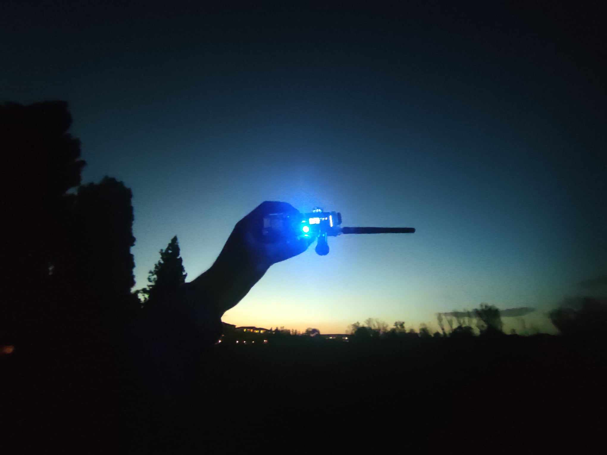
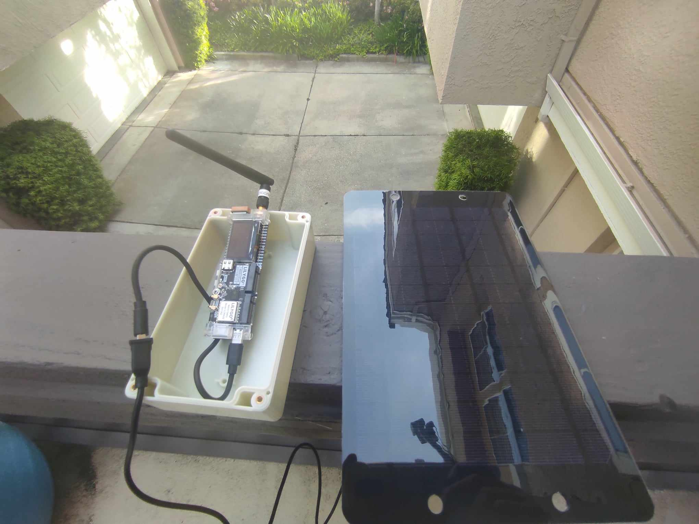
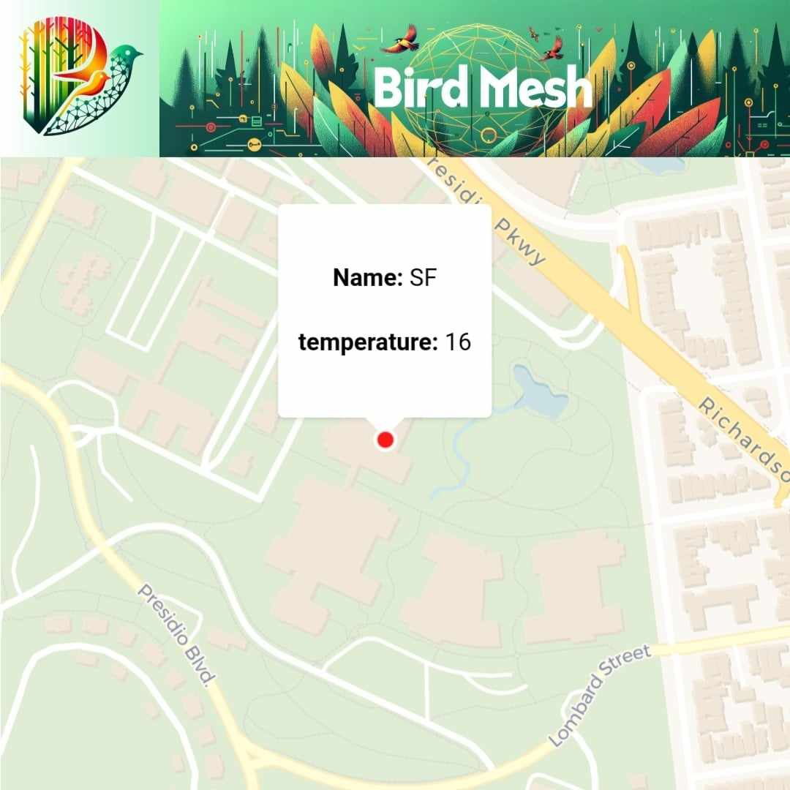

# BIRDMESH - A small lora mesh network to record and study birds

<audio controls>
  <source src="./frogs.mp4" type="audio/mpeg">
Your browser does not support the audio element.
</audio>

<audio controls>
  <source src="./frogs2.mp4" type="audio/mpeg">
Your browser does not support the audio element.
</audio>

## Introduction

BirdMesh is a small lora mesh network to record and study birds. The network consists of a number of nodes that are placed in the field. Each node is equipped with a microphone and a lora transceiver. The nodes are connected to a central server that collects the data and stores it in a database. The server also provides a web interface to visualize the data and to configure the nodes.

## Hardware

The development board is lilygo's ttgo t-beam s3 supreme. The board is equipped with an ESP32S3, a lora transceiver, a GPS module, a microphone, and a battery. The board is powered by a 18650 battery and can be recharged via USB. The board is enclosed in waterproof casing.

## Firmware 

The firmware uses FreeRTOS to manage the tasks. The Nodes communicate over a lora mesh network based on [LoRaMesher](https://github.com/LoRaMesher/LoRaMesher) and uses Nano-ProtoBuf to serialise the data. 

## Server

The server is a simple postgres database that stores the data. The server also provides a web interface to visualize the data and to configure the nodes. The server uses vue.js.

